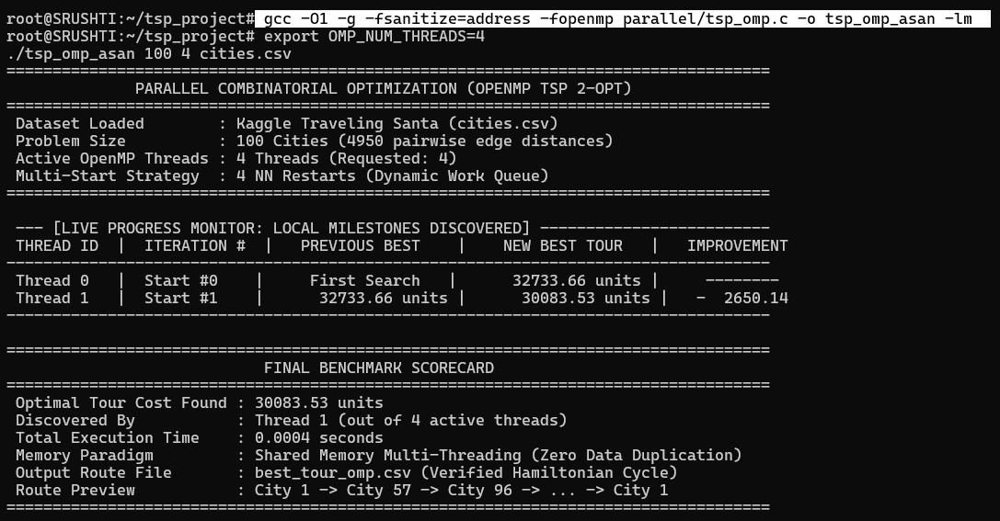
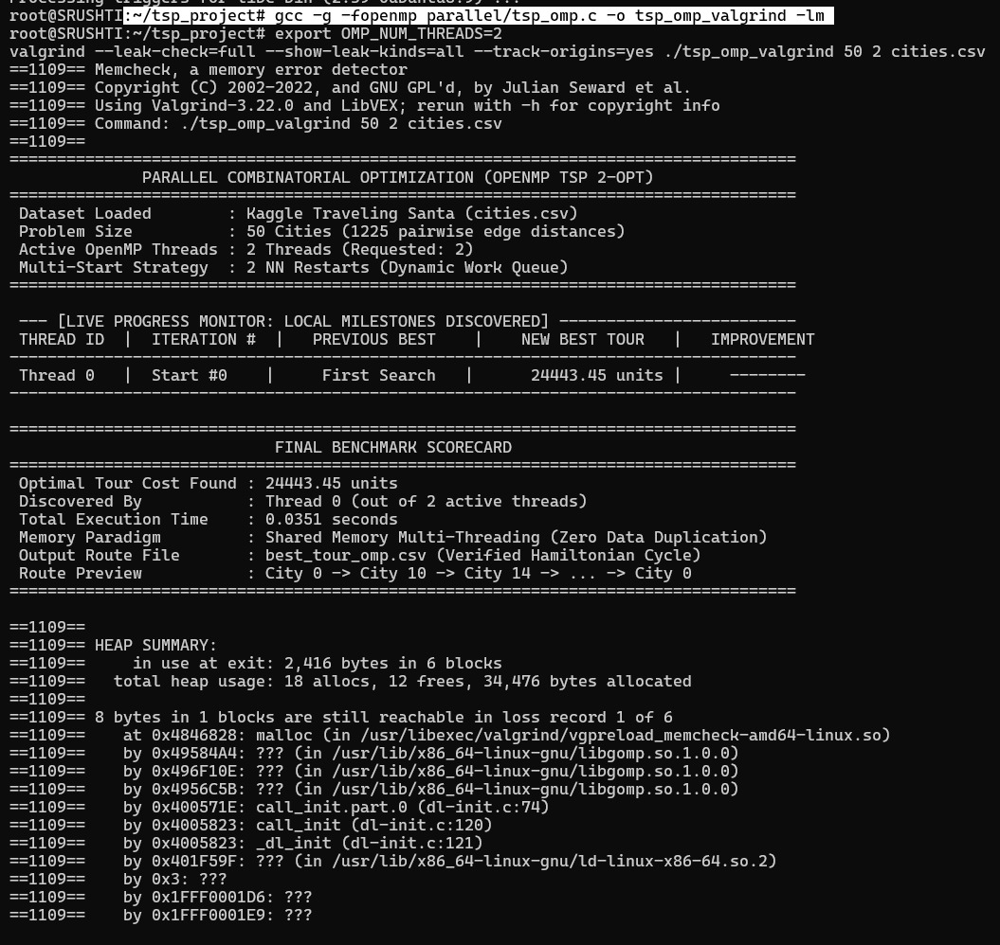
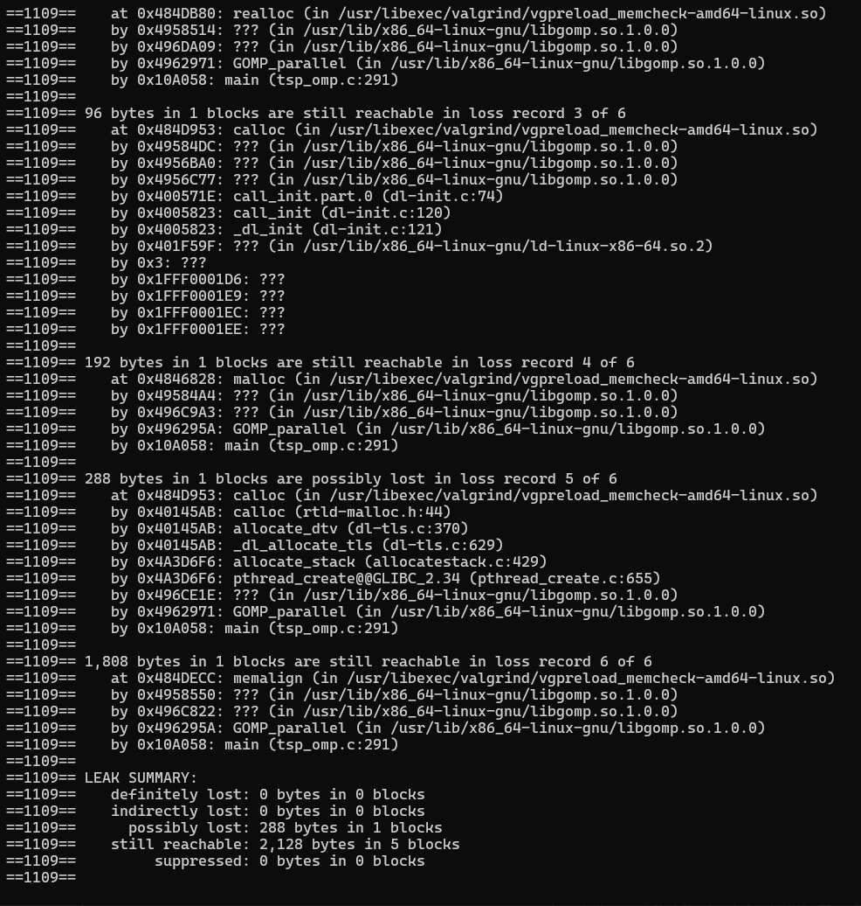

# Combinatorial_optimization

Identify a suitable real-world combinatorial optimization problem and develop a computational solution capable of handling significantly larger problem instances than a basic sequential implementation.

# Parallel & Sequential Traveling Salesperson Problem (TSP) Solvers

A high-performance C implementation and benchmarking suite for the **Traveling Salesperson Problem (TSP)** evaluated on the **Kaggle Traveling Santa 2018 – Prime Paths** dataset (`cities.csv`).

This repository provides both a modular **sequential baseline** and a **multi-threaded parallel solver** utilizing **OpenMP shared-memory parallelism**.

The sequential implementation uses **Nearest Neighbor construction followed by 2-Opt local search**, while the parallel implementation uses **multi-start search, precomputed distance matrices, and OpenMP parallelism**.

---

## Repository Architecture

```text
Combinatorial_optimization/
├── cities.csv
│
├── parallel/
│   └── tsp_omp.c          # Multi-start OpenMP parallel solver with precomputed distance matrix
│
├── sequential/
│   ├── data_loader.c      # CSV parsing utilities
│   ├── data_loader.h      # City coordinate structure and prototypes
│   ├── nearest_neighbor.c # Single-start greedy constructive heuristic
│   ├── nearest_neighbor.h # Nearest Neighbor header
│   ├── subset.c           # Dataset subset bound validation
│   ├── subset.h           # Subset prototypes
│   ├── tsp_seq.c          # Sequential baseline driver
│   ├── tsp_utils.c        # Distance computation and tour validation
│   ├── tsp_utils.h        # TSP utilities header
│   ├── two_opt.c          # On-the-fly 2-Opt local search
│   └── two_opt.h          # 2-Opt header
│
├── tests/
│   ├── test_loader.c      # Dataset loading unit tests
│   ├── test_nn.c          # Nearest Neighbor verification tests
│   ├── test_subset.c      # Problem size boundary tests
│   ├── test_two_opt.c     # 2-Opt swap unit tests
│   └── test_utils.c       # Distance and Hamiltonian cycle validation tests
│
├── Makefile               # Modular build configuration
├── .gitignore             # Build artifact and binary exclusions
└── README.md              # Project documentation
```

---

# Algorithmic Details & Methodology

The project compares two approaches for solving **Euclidean Traveling Salesperson Problem (TSP)** instances.

## 1. Sequential Baseline

The sequential solver provides the baseline implementation against which the parallel solver can be evaluated.

### Construction: Nearest Neighbor

The initial tour is generated using the classic greedy **Nearest Neighbor (NN)** heuristic.

The algorithm starts from **city index 0**. At each step, it scans the unvisited cities and selects the city with the smallest Euclidean distance from the current city.

This produces an initial feasible Hamiltonian tour.

### Local Optimization: 2-Opt

The initial Nearest Neighbor tour is improved using **2-Opt local search**.

For two edges:

```text
A → B
C → D
```

the algorithm checks whether replacing them with:

```text
A → C
B → D
```

produces a shorter route.

If the new pair of edges reduces the total tour length, the intermediate section of the tour is reversed.

The process continues until no improving 2-Opt move remains.

### Distance Calculation

The sequential implementation calculates Euclidean distances **on demand** rather than storing a complete distance matrix.

The distance between two cities is:

```text
d = √((x₂ - x₁)² + (y₂ - y₁)²)
```

This reduces memory usage compared with storing an `N × N` distance matrix, while requiring distance calculations during the search.

### Problem Size

The solver loads the `cities.csv` dataset and can process a requested subset of the available cities.

The dataset contains **197,769 cities**, allowing the implementation to be tested on progressively larger problem instances.

### Starting Point

The current sequential implementation starts the Nearest Neighbor tour from **city index 0**.

### Tour Validation

After optimization, the generated tour is validated to ensure that:

- every city appears exactly once,
- all city indices are within the valid range,
- the tour forms a valid Hamiltonian cycle.

### Sequential Output

The sequential solver reports:

- Initial Nearest Neighbor tour length
- Final 2-Opt tour length
- Tour validity
- Execution time
- Tour preview

The final tour is also saved to:

```text
best_tour.csv
```

---

## 2. Parallel OpenMP Solver

The parallel implementation uses OpenMP shared-memory parallelism to evaluate multiple TSP starting points concurrently.

### Distance Matrix Precomputation

All pairwise Euclidean distances are precomputed into an `N × N` distance matrix.

This replaces repeated distance calculations with `O(1)` distance lookups during optimization.

### Parallel Distance Computation

The distance matrix is computed in parallel using OpenMP:

```c
#pragma omp parallel for
```

### Multi-Start Search

Multiple starting cities are evaluated independently.

Each starting city generates:

1. A Nearest Neighbor tour
2. A 2-Opt optimized tour

The best tour found across all starting points is retained.

### Dynamic Work Balancing

Work is dynamically distributed across OpenMP threads using:

```c
#pragma omp for schedule(dynamic, 1)
```

This allows threads that finish earlier to take the next available starting city.

### Thread-Safe Best Solution

When a thread discovers a better tour, the global best solution is updated inside an OpenMP critical section:

```c
#pragma omp critical
```

This prevents race conditions while updating the global best tour.

---

# Prerequisites & Setup

The project requires:

- GCC
- OpenMP
- Make
- Linux/Ubuntu

Install the required packages on Ubuntu:

```bash
sudo apt update
sudo apt install build-essential gcc make -y
```

Make sure the `cities.csv` dataset is available in the project root directory:

```text
Combinatorial_optimization/
├── cities.csv
├── parallel/
├── sequential/
├── tests/
├── Makefile
└── README.md
```

The `cities.csv` dataset is not included in the Git repository because of its size and is expected to be downloaded separately from the Kaggle Traveling Santa 2018 – Prime Paths competition.

---

# Compilation & Execution

## 1. Sequential Solver (`tsp_seq`)

The sequential solver requires only the number of cities `N` as a command-line argument.

### Compilation

From the project root:

```bash
gcc -O3 -Isequential sequential/*.c -o tsp_seq -lm
```

### Execution

Run the solver by specifying the number of cities:

```bash
./tsp_seq 500
```

For example, the above command processes the first 500 cities from `cities.csv`.

### Sequential Solver Parameters

| Parameter | Description |
|---|---|
| `NUM_CITIES` | Number of cities to process |

The current sequential implementation:

- Accepts only `NUM_CITIES`.
- Uses `cities.csv` as the dataset.
- Starts the Nearest Neighbor tour from city index 0.
- Applies 2-Opt local search to improve the initial tour.
- Does not use a `NUM_STARTS` parameter.
- Does not accept the CSV path as a command-line argument.

### Output

The sequential solver generates:

```text
best_tour.csv
```

and displays the following information in the terminal:

```text
Nearest Neighbor length
Final tour length
Tour validity
Execution time
Tour preview
```

---

## 2. Parallel OpenMP Solver (`tsp_omp`)

The parallel solver uses OpenMP and supports multiple starting points.

### Compilation

From the project root:

```bash
gcc -O3 -march=native -fopenmp parallel/tsp_omp.c -o tsp_omp -lm
```

### Execution Syntax

```bash
./tsp_omp [NUM_CITIES] [NUM_STARTS] [CSV_PATH]
```

### Parameters

| Parameter | Default | Description |
|---|---:|---|
| `NUM_CITIES` | 500 | Number of cities to evaluate |
| `NUM_STARTS` | 64 | Number of starting cities used for multi-start search |
| `CSV_PATH` | cities.csv | Path to the dataset |

### Example

```bash
./tsp_omp 500 64 cities.csv
```

---

# OpenMP Thread Scaling

The number of OpenMP threads can be controlled using the `OMP_NUM_THREADS` environment variable.

### 1 Thread

```bash
export OMP_NUM_THREADS=1
./tsp_omp 500 64 cities.csv
```

### 2 Threads

```bash
export OMP_NUM_THREADS=2
./tsp_omp 500 64 cities.csv
```

### 4 Threads

```bash
export OMP_NUM_THREADS=4
./tsp_omp 500 64 cities.csv
```

### 8 Threads

```bash
export OMP_NUM_THREADS=8
./tsp_omp 500 64 cities.csv
```

These configurations can be used to measure the **strong scaling** of the parallel implementation.

---
## Dynamic Memory Management & Leak Verification

To ensure memory safety and prevent resource leaks during both sequential and multi-threaded execution, the OpenMP TSP solver was tested using two industry-standard memory analysis tools:

* **GCC AddressSanitizer (ASan)**
* **Valgrind Memcheck**

These tools were used to verify heap allocation, deallocation, buffer safety, and memory behavior during parallel execution.

### 1. Memory Management Strategy

The solver dynamically allocates memory for both shared data structures and thread-private working buffers.

#### Shared Memory

The following structures are allocated once and shared across the OpenMP threads:

* `cities` – stores city coordinates
* `dist_matrix` – stores the precomputed distance matrix
* `global_best_tour` – stores the best tour found by the solver

#### Thread-Private Memory

Each OpenMP worker thread maintains its own working buffers:

* `local_tour` – stores the thread's current tour
* `local_visited` – tracks visited cities

Thread-private buffers are allocated inside the OpenMP parallel region and released using the corresponding `free()` calls. Shared memory is also explicitly released before program termination.

---

### 2. AddressSanitizer (ASan) Verification

**AddressSanitizer (ASan)** was used to detect memory-related errors such as:

* Heap buffer overflows
* Heap-use-after-free
* Invalid memory accesses
* Memory leaks through LeakSanitizer

#### Compilation

```bash
gcc -O1 -g -fsanitize=address -fopenmp parallel/tsp_omp.c -o tsp_omp_asan -lm
```

#### Execution

```bash
export OMP_NUM_THREADS=4
./tsp_omp_asan 100 4 cities.csv
```

#### Result

The program completed successfully without any AddressSanitizer runtime errors or LeakSanitizer leak reports. The process terminated normally with exit code `0`.

**AddressSanitizer Verification:**



> **Result:** No heap-buffer-overflow, use-after-free, or memory leak diagnostics were reported during the verification run.

---

### 3. Valgrind Memcheck Verification

**Valgrind Memcheck** was used to perform a detailed analysis of dynamic memory allocation and deallocation.

#### Compilation

```bash
gcc -g -fopenmp parallel/tsp_omp.c -o tsp_omp_valgrind -lm
```

#### Execution

```bash
export OMP_NUM_THREADS=2
valgrind --leak-check=full --show-leak-kinds=all --track-origins=yes ./tsp_omp_valgrind 50 2 cities.csv
```

#### Valgrind Results

The Valgrind analysis reported:

```text
LEAK SUMMARY:
    definitely lost: 0 bytes in 0 blocks
    indirectly lost: 0 bytes in 0 blocks
    possibly lost: 288 bytes in 1 blocks
    still reachable: 2,128 bytes in 5 blocks
    suppressed: 0 bytes in 0 blocks
```

**Valgrind Memcheck Output — Screenshot 1:**





#### Verification Analysis

* **Definitely lost: 0 bytes** — No memory blocks were confirmed as leaked or orphaned.
* **Indirectly lost: 0 bytes** — No indirectly leaked memory was detected.
* **Possibly lost: 288 bytes** — A small amount of memory was reported as possibly lost by Valgrind, which can occur with thread/runtime-related allocations.
* **Still reachable: 2,128 bytes** — Memory remained referenced at process termination and is not classified as definitely lost.
* **Suppressed: 0 bytes** — No errors were suppressed during the analysis.

The **0 bytes definitely lost** result provides the primary indication that no definite application-level memory leaks were detected during the test.

---

### 4. Memory Verification Summary

| Tool              | Configuration                  | Result                                   |
| ----------------- | ------------------------------ | ---------------------------------------- |
| AddressSanitizer  | 4 OpenMP threads, 100-city run | No runtime memory errors or leak reports |
| Valgrind Memcheck | 2 OpenMP threads, 50-city run  | 0 bytes definitely lost                  |
| Valgrind          | Indirectly lost                | 0 bytes                                  |
| Valgrind          | Possibly lost                  | 288 bytes                                |
| Valgrind          | Still reachable                | 2,128 bytes                              |

Overall, the memory audit found **no definite application-level memory leaks** and confirmed correct dynamic memory handling during multi-threaded execution.

---
# Sequential Benchmarking

The sequential solver was evaluated on progressively larger problem sizes using the same `cities.csv` dataset.

All benchmark runs were performed using the sequential implementation with:

- Nearest Neighbor construction
- 2-Opt local search
- On-demand Euclidean distance calculation
- Starting city index 0

| Number of Cities | NN Tour Length | Final 2-Opt Length | Execution Time (s) | Valid Tour |
|---:|---:|---:|---:|:---:|
| 500 | 81,215.36 | 67,845.87 | 0.078884 | YES |
| 1,000 | 105,938.55 | 93,768.98 | 0.684759 | YES |
| 2,000 | 148,210.45 | 130,241.40 | 4.637591 | YES |
| 5,000 | 229,937.06 | 204,381.65 | 55.886664 | YES |
| 8,000 | 291,919.82 | 254,469.54 | 316.416526 | YES |

### Observations

The benchmark results demonstrate that the computational cost of the sequential solver increases rapidly as the problem size grows.

The 2-Opt local search consistently improves the initial Nearest Neighbor tour across all tested problem sizes.

For example:

- At 500 cities, the tour length improves from `81,215.36` to `67,845.87`.
- At 8,000 cities, the tour length improves from `291,919.82` to `254,469.54`.

All tested tours were successfully validated.

The 8,000-city instance required approximately **316 seconds (5.3 minutes)** on the test system. This demonstrates the increasing computational cost of the sequential approach and motivates the use of parallel execution for larger problem instances.

---
# Parallel Benchmarking

The parallel OpenMP solver was evaluated on progressively larger problem sizes using the same `cities.csv` dataset and different OpenMP thread configurations.

All benchmark runs were performed using the parallel implementation with:

* Multi-start Nearest Neighbor construction
* 2-Opt local search
* Precomputed Euclidean distance matrix
* Dynamic OpenMP scheduling using `schedule(dynamic, 1)`
* Thread-safe global best tour tracking

| Number of Cities | Starts | Active Threads | Final 2-Opt Length | Execution Time (s) | Discovered By | Valid Tour |
| ---------------: | -----: | -------------: | -----------------: | -----------------: | :------------ | :--------: |
|              500 |     24 |              4 |          65,188.04 |           0.023600 | Thread 0      |     YES    |
|              500 |     24 |              8 |          65,188.04 |           0.023000 | Thread 0      |     YES    |
|              500 |     24 |             12 |          65,188.04 |           0.039100 | Thread 2      |     YES    |
|            1,000 |     24 |              4 |          92,258.78 |           0.077600 | Thread 3      |     YES    |
|            1,000 |     24 |              8 |          92,258.78 |           0.068700 | Thread 3      |     YES    |
|            1,000 |     24 |             12 |          92,258.78 |           0.061600 | Thread 3      |     YES    |
|            2,000 |     24 |              4 |         128,848.39 |           0.545000 | Thread 3      |     YES    |
|            2,000 |     24 |              8 |         128,848.39 |           0.433300 | Thread 4      |     YES    |
|            2,000 |     24 |             12 |         128,848.39 |           0.432300 | Thread 1      |     YES    |
|            5,000 |     24 |              4 |         200,603.03 |           6.452300 | Thread 0      |     YES    |
|            5,000 |     24 |              8 |         200,603.03 |           4.342500 | Thread 3      |     YES    |
|            5,000 |     24 |             12 |         200,603.03 |           4.052300 | Thread 2      |     YES    |
|            8,000 |     24 |              4 |         253,147.21 |          26.388300 | Thread 3      |     YES    |
|            8,000 |     24 |              8 |         253,147.21 |          19.649600 | Thread 2      |     YES    |
|            8,000 |     24 |             12 |         253,147.21 |          17.227600 | Thread 2      |     YES    |

### Observations

The benchmark results show that the parallel solver reduces execution time as the number of OpenMP threads increases, particularly for larger problem instances.

The multi-start approach evaluates multiple starting cities independently, allowing different threads to explore alternative initial tours and retain the best solution found.

For example:

* At 500 cities, the parallel solver obtained a final tour length of `65,188.04` in approximately `0.023` seconds using 8 threads.
* At 5,000 cities, execution time decreased from `6.452300` seconds with 4 threads to `4.052300` seconds with 12 threads.
* At 8,000 cities, execution time decreased from `26.388300` seconds with 4 threads to `17.227600` seconds with 12 threads.

The parallel multi-start search also produced shorter tours than the sequential single-start implementation:

* At 500 cities, the final tour length improved from `67,845.87` sequentially to `65,188.04` using the parallel multi-start approach.
* At 8,000 cities, the final tour length improved from `254,469.54` sequentially to `253,147.21` using the parallel implementation.

All tested parallel tours were successfully validated as valid Hamiltonian cycles.

The results demonstrate that OpenMP parallelism provides significant runtime reduction for larger TSP instances while the multi-start strategy can improve solution quality by exploring multiple starting points concurrently.

---
# Sequential vs Parallel Evaluation

The sequential implementation serves as the baseline for evaluating the performance of the OpenMP implementation.

The two implementations differ primarily in how the search space is explored:

| Feature | Sequential | Parallel OpenMP |
|---|---|---|
| Construction | Nearest Neighbor | Multi-start Nearest Neighbor |
| Local Search | 2-Opt | 2-Opt |
| Starting Points | Single start | Multiple starts |
| Distance Calculation | On demand | Precomputed distance matrix |
| Parallelism | None | OpenMP shared-memory |
| Work Distribution | Sequential | `schedule(dynamic, 1)` |
| Best Solution | Single tour | Shared best tour with synchronization |
| Main Goal | Baseline | Improved scalability |

The sequential benchmark establishes the execution-time baseline, while the OpenMP implementation can be evaluated using different thread counts to study performance scaling.

---

# Dataset

The project uses the **Kaggle Traveling Santa 2018 – Prime Paths** dataset.

The main dataset file is:

```text
cities.csv
```

It contains the following columns:

| Column | Description |
|---|---|
| `CityId` | Unique identifier of the city |
| `X` | X-coordinate |
| `Y` | Y-coordinate |

The complete dataset contains **197,769 cities**.

The sequential implementation supports processing a requested subset of these cities, allowing experiments with progressively larger problem instances.

---

# Testing

The repository includes unit tests for the main sequential components:

```text
tests/
├── test_loader.c
├── test_nn.c
├── test_subset.c
├── test_two_opt.c
└── test_utils.c
```

The tests cover:

- CSV data loading
- Nearest Neighbor tour generation
- Dataset subset size validation
- 2-Opt operations
- Euclidean distance calculation
- Tour validity and Hamiltonian cycle validation

---

# Key Takeaways

This project demonstrates how a real-world combinatorial optimization problem can be approached using both sequential and parallel computational techniques.

The **sequential solver** establishes a modular baseline using:

- Nearest Neighbor
- 2-Opt local search
- On-demand distance computation
- Tour validation

The **parallel solver** extends the approach using:

- OpenMP shared-memory parallelism
- Precomputed distance matrix
- Multi-start search
- Dynamic work scheduling
- Thread-safe global best solution

The increasing execution time observed in the sequential benchmarks demonstrates the computational challenge of larger TSP instances and provides motivation for parallelizing the workload.

---

# Project Goal

The overall goal is to demonstrate that parallel computation can be used to address the increasing computational cost of combinatorial optimization as problem size grows.

The sequential implementation provides the baseline, while the OpenMP implementation explores how independent portions of the search can be distributed across multiple CPU threads.
